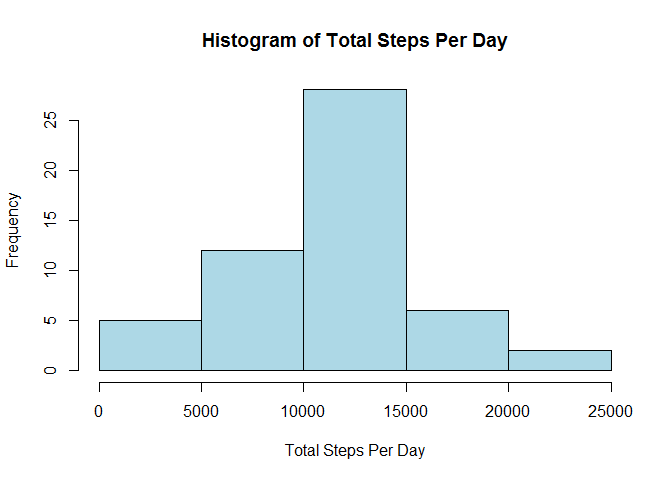
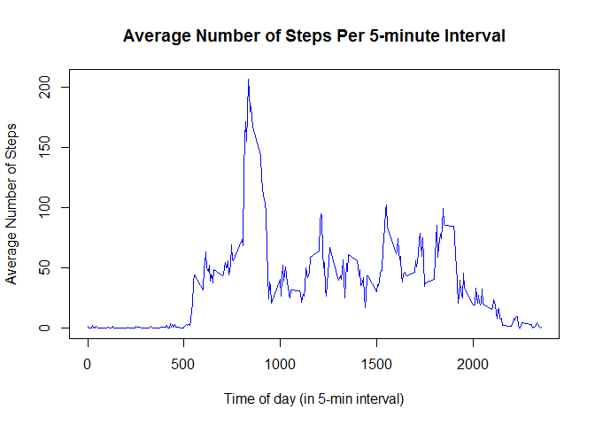
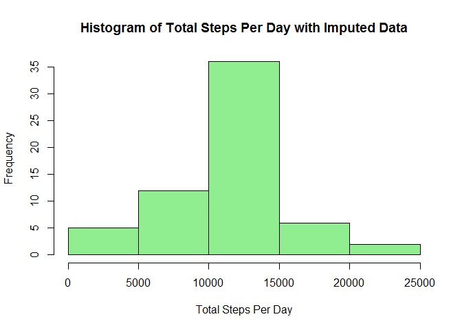
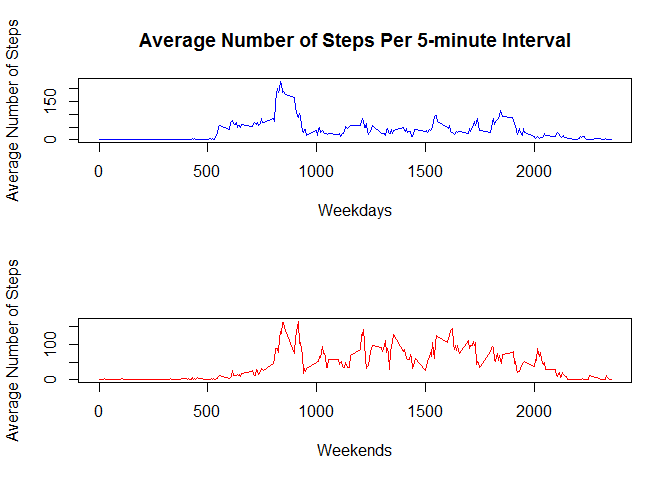

# Reproducible Research - Project 1
David Ciocca  
March 20, 2016  

Code for reading in the dataset and/or preprocessing the data


```r
# Read datafile into R.
stepData <- read.csv("activity.csv", header = TRUE)
```


Histogram of the total number of steps taken each day

```r
# Plot histogram of steps taken per day
stepHist <- tapply(stepData$steps, stepData$date, sum)
hist(stepHist,
     main = "Histogram of Total Steps Per Day",
     xlab = "Total Steps Per Day",
     col = "light blue")
```




Mean and Median of number of steps taken each day

```r
# Mean & Median of Steps Per Day
stepMean <- mean(stepHist, na.rm = TRUE)
stepMean
```

```
## [1] 10766.19
```

```r
stepMed <- median(stepHist, na.rm = TRUE)
stepMed
```

```
## [1] 10765
```


Time series plot of the average number of steps taken

```r
# Time Series plot of average number of steps taken per 5-minute interval
step5 <- tapply(stepData$steps, stepData$interval, mean, na.rm = TRUE)
plot(names(step5), step5, type = "l",
     main = "Average Number of Steps Per 5-minute Interval",
     xlab = "Time of day (in 5-min interval)",
     ylab = "Average Number of Steps",
     col = "blue")
```




The 5-minute interval that, on average, contains the maximum number of steps

```r
# 5-minute interval with maximum average number of steps
max5 <- max(step5)
max5Time <- names(step5)[max5 == step5]
max5Time
```

```
## [1] "835"
```


Code to describe and show a strategy for imputing muissing data

- The code will use the average values for each respective 5-minute interval to
fill-in missing values.

```r
# Code to describe and show a strategy for imputing missing data
# Total missing values
numNA <- sum(is.na(stepData$steps))
numNA
```

```
## [1] 2304
```

```r
# Fill in missing 5-minute values & create dataset with them inserted
eachNA <- is.na(stepData$steps)
newData <- stepData
newData$steps[eachNA] <- step5[as.character(newData$interval[eachNA])]
newHist <- tapply(newData$steps, newData$date, sum)
```


Histogram of the total number of steps taken each day after missing values 
are imputed

```r
#Plot histogram of total steps including imputed data        
hist(newHist,
     main = "Histogram of Total Steps Per Day with Imputed Data",
     xlab = "Total Steps Per Day",
     col = "light green")
```




Panel plot comparing average number of steps taken per 5-minute interval across
weekdays and weekends.

```r
# Panel plot to compare average 5-minute interval steps on weekdays vs.weekends.
library(lattice)

newData$date <- as.Date(newData$date)
newData$WDay <- weekdays(newData$date)
newData$WEnd <- as.factor(ifelse(newData$WDay == "Saturday" | 
                        newData$WDay == "Sunday", 
                        "Weekend", "weekday"))

newStep5 <- aggregate(newData$steps, by=list(newData$interval, newData$WEnd), mean)
weekData <- newStep5[newStep5$Group.2 == "weekday", ]
weekEnd <- newStep5[newStep5$Group.2 != "weekday", ]

par(mfrow =c(2, 1))

plot(weekData$Group.1, weekData$x, type = "l",
     main = "Average Number of Steps Per 5-minute Interval",
     xlab = "Weekdays",
     ylab = "Average Number of Steps",
     col = "blue")

plot(weekEnd$Group.1, weekEnd$x, type = "l",
     xlab = "Weekends",
     ylab = "Average Number of Steps",
     col = "red")
```


